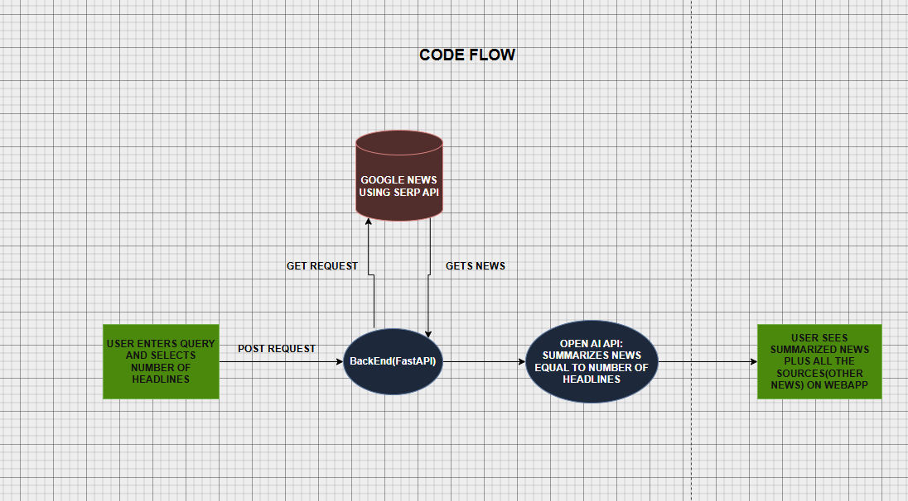

# HOTTEST TECH NEWS


# Deployed link (Change the search query as per your need)
- Please view it on a laptop for better experience.

https://hottest-tech-news.fly.dev/

# Tech News Summarizer

A FastAPI + React (Vite) app that fetches hot tech news with SerpApi and summarizes it with OpenAI.

## Tech stack
- FastAPI (Python) for the backend API
- React + Vite for the frontend
- SerpApi for news search
- OpenAI API for summarization
- Docker for containerized deploys
- Fly.io for cloud deploys

## How to run locally

### Backend (FastAPI)
1. Create a virtual environment and install dependencies:
   ```bash
   cd backend
   python -m venv .venv
   .venv\Scripts\activate
   pip install -r requirements.txt
   ```
2. Copy environment variables:
   ```bash
   copy .env.example .env
   ```
3. Set your keys in `backend/.env`:
   - `OPENAI_API_KEY`
   - `SERPAPI_API_KEY`
   - Optional: `OPENAI_MODEL` (default `gpt-5`)
4. Run the API:
   ```bash
   uvicorn app.main:app --reload --port 8000
   ```

### Frontend (Vite React)
1. Install Node.js (includes npm): https://nodejs.org/
2. Install dependencies:
   ```bash
   cd frontend
   npm install
   ```
3. Run the frontend:
   ```bash
   npm run dev
   ```

## API usage
- `POST /api/summarize`
  - Body: `{ "query": "hottest technology news", "num_results": 8 }`
  - Response includes `summary` and `articles`.

## Approach & tradeoffs

- The backend calls SerpApi `google_news` for fresh headlines and normalizes the results into a consistent schema.
- A compact prompt is built from titles, sources, dates, and links, then sent to OpenAI for summarization.
- The summary is rendered as bullet points with bolded headlines for fast scanning.
- The frontend calls the backend directly and displays the sources with publisher icons and thumbnails.
- Clicking "Read story" opens the original news article in a new browser tab.
- Tradeoff: No semantic ranking or deduping beyond what SerpApi returns.
- Tradeoff: Single‑shot summarization keeps latency low but may miss deeper context.
- Tradeoff: The demo uses only U.S. Google News results to keep the response fast.

## AI tools used
- OpenAI API (`chat.completions`) for summarizing the news list.
- CODEX for making UI better.

## Improvements in future
- Add clustering/deduplication to reduce overlapping stories.
- Add caching to lower SerpApi/OpenAI costs and improve response time.
- Add retry/backoff for transient API errors and rate limits.
- Add user presets for common topics and summary length.
- Improve UI for better user experience.
- Can implement langchain or AutogenAI for more advanced summarization.
- Add a time filter (last 24 hours / last week) for fresher summaries.
- Show estimated reading time and sentiment.
- Can add RAG based chatbot where user can query and ask questions about the news articles.
